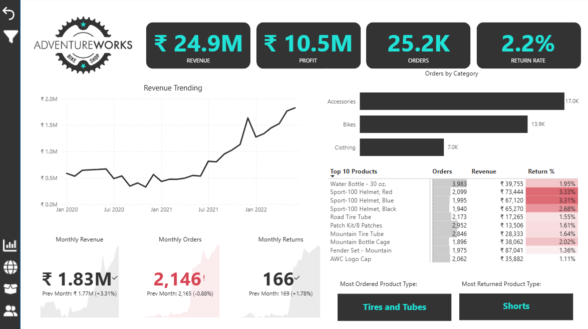
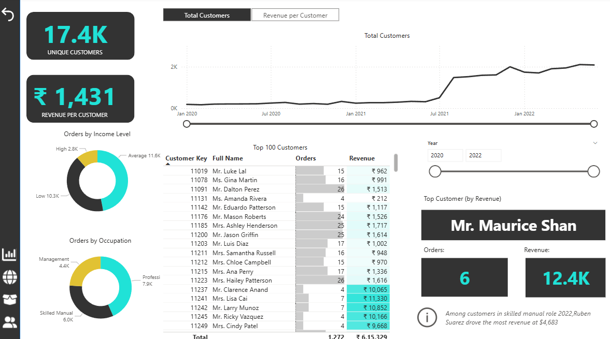
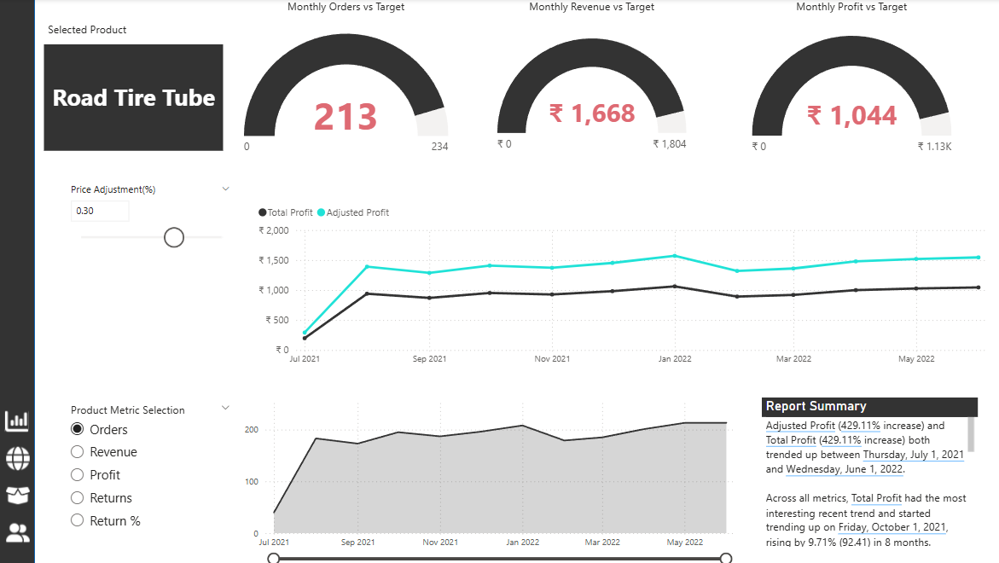
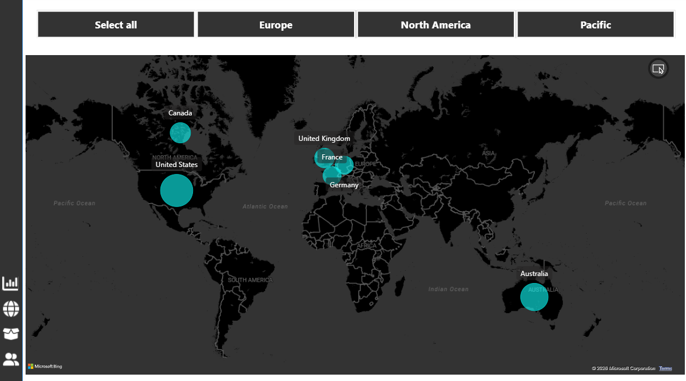

# 📊 Adventure Works Power BI Dashboard

## 📌 Project Overview

This project is an end-to-end Power BI dashboard built using the Adventure Works dataset to analyze business performance, customer behavior, product trends, and regional sales.

## 📂 Dashboard Sections

* Executive Dashboard
* Map View
* Product Analysis
* Customer Analysis

---

## 📸 Dashboard Preview

### Executive Overview

### Customer Analysis

### Product Performance

### Regional Analysis

---

## 📊 Key Insights

* Revenue: ₹24.9M | Profit: ₹10.5M | Orders: 25.2K
* Revenue increased despite slower customer growth (higher spend per customer)
* Accessories drive volume, premium products drive revenue
* Higher return rates observed in certain products (quality concern)
* Sales heavily concentrated in North America
* Top customers contribute significant revenue

---

## 💡 Recommendations

* Target high-value customers
* Improve product quality
* Expand into Europe & Pacific regions
* Optimize pricing strategy

---

## 🛠 Tools Used

* Power BI Desktop
* DAX
* Data Modeling
* Interactive Visuals

---

## 📁 Files

* Adventure_Works_Dashboard.pbix
* screenshots/
